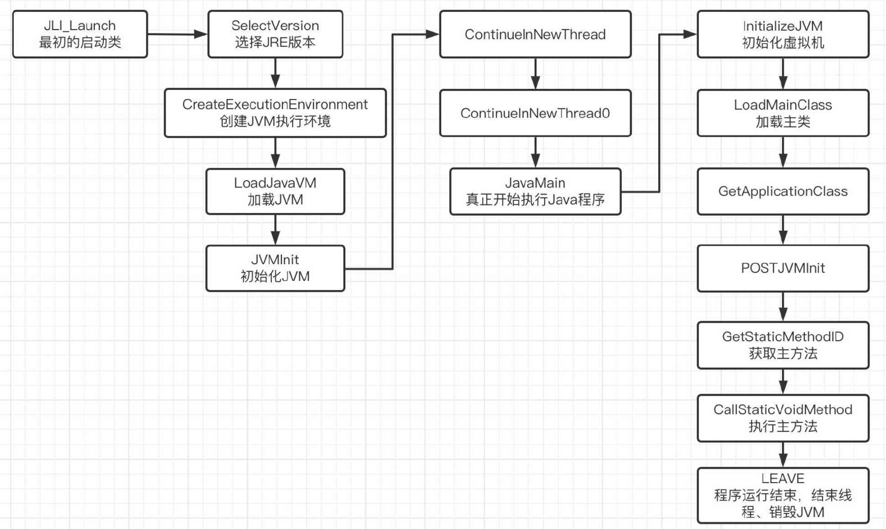
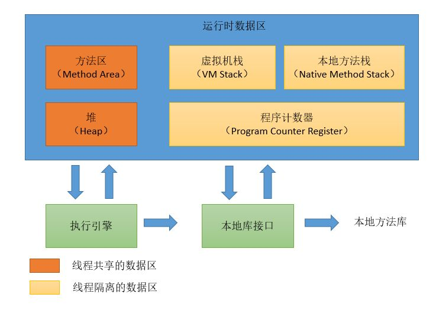

# jvm
## JVM启动流程探究

虚拟机的启动入口位于`jdk/src/share/bin/java.c`的`JLI_Launch`函数，流程有如下步骤

1. 配置JVM装载环境

2. 解析虚拟机参数

3. 设置线程栈大小

4. 执行JavaMain方法

```Shell
int
JLI_Launch(int argc, char ** argv,              /* main argc, argc */
        int jargc, const char** jargv,          /* java args */
        int appclassc, const char** appclassv,  /* app classpath */
        const char* fullversion,                /* full version defined */
        const char* dotversion,                 /* dot version defined */
        const char* pname,                      /* program name */
        const char* lname,                      /* launcher name */
        jboolean javaargs,                      /* JAVA_ARGS */
        jboolean cpwildcard,                    /* classpath wildcard */
        jboolean javaw,                         /* windows-only javaw */
        jint     ergo_class                     /* ergnomics policy */
);
```


流程图

## JVM内存管理

#### 内存区域划分




