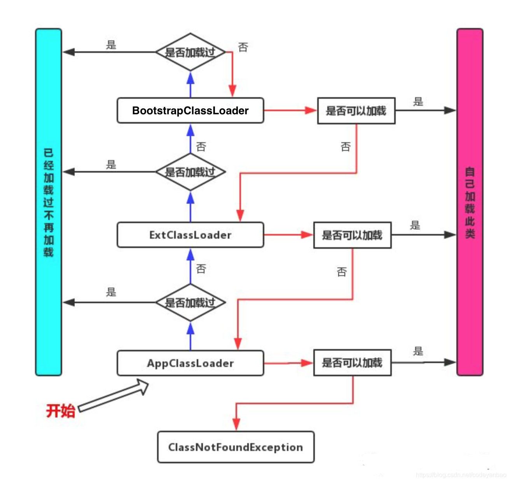

# 反射
# java类加载机制

1、加载（Loading)

2、验证（Verification)

3、准备（Preparation)

4、解析（Resolution）

5、初始化（Initialization）

6、使用（Using）

7、卸载（Unloading）

Java程序启动时，JVM会将一部分类（class文件）先加载（并不是所有类都在一开始就加载），通过ClassLoader将类加载，在加载过程中，会将类的信息提取出来，放在JVM元空间里，同时生成一个Class对象放在内存（堆内存）。此时Class对象只有一个，与加载的类唯一对应。

# 双亲委派模型

